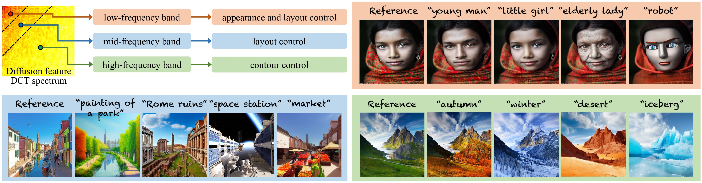
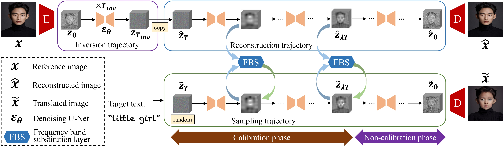

# FBSDiff: Plug-and-Play Frequency Band Substitution of Diffusion Features for Highly Controllable Text-Driven Image Translation
[ACM MM 2024] Official code of the paper "FBSDiff: Plug-and-Play Frequency Band Substitution of Diffusion Features for Highly Controllable Text-Driven Image Translation". [Paper link](https://arxiv.org/abs/2408.00998)

# Citation #
<pre>
<code>
@inproceedings{gao2024fbsdiff,
  title={FBSDiff: Plug-and-Play Frequency Band Substitution of Diffusion Features for Highly Controllable Text-Driven Image Translation},
  author={Gao, Xiang and Liu, Jiaying},
  booktitle={Proceedings of the 32nd ACM International Conference on Multimedia},
  pages={4101--4109},
  year={2024}
}
</code>
</pre>

Based on the pre-trained text-to-image diffusion model, FBSDiff enables efficient text-driven image-to-image translation by proposing a plug-and-play reference image guidance mechanism. It allows flexible control over different guiding factors (e.g., image appearance, image layout, image contours) of the reference image to the T2I generated image, simply by dynamically substituting different types of DCT frequency bands during the reverse sampling process of the diffusion model.

# Introduction
Large-scale text-to-image diffusion models have been a revolutionary milestone in the evolution of generative AI and multimodal technology, allowing wonderful image generation with natural-language text prompt. However, the issue of lacking controllability of such models restricts their practical applicability for real-life content creation. Thus, attention has been focused on leveraging a reference image to control text-to-image synthesis, which is also regarded as manipulating (or editing) a reference image as per a text prompt, namely, text-driven image-to-image translation. This paper contributes a novel, concise, and efficient approach that adapts pre-trained large-scale text-to-image (T2I) diffusion model to the image-to-image (I2I) paradigm in a plug-and-play manner, realizing high-quality and versatile text-driven I2I translation without any model training, model fine-tuning, or online optimization process. To guide T2I generation with a reference image, we propose to decompose diverse guiding factors with different frequency bands of diffusion features in the DCT spectral space, and accordingly devise a novel frequency band substitution layer which realizes dynamic control of the reference image to the T2I generation result in a plug-and-play manner. We demonstrate that our method allows flexible control over both guiding factor and guiding intensity of the reference image simply by tuning the type and bandwidth of the substituted frequency band, respectively. Extensive qualitative and quantitative experiments verify superiority of our approach over related methods in I2I translation visual quality, versatility, and controllability. 

# Model overview

Overview of FBSDiff. Based on the pre-trained latent diffusion model (LDM), FBSDiff starts with an inversion trajectory that inverts reference image into the LDM Gaussian noise space, then a reconstruction trajectory is applied to reconstruct the reference image from the inverted Gaussian noise, providing intermediate denoising results as pivotal guidance features. The guidance features are leveraged to guide the text-driven sampling trajectory of the LDM to exert reference image control, which is realized by dynamically transplanting certain DCT frequency bands from diffusion features along the reconstruction trajectory into the corresponding features along the sampling trajectory. The dynamic DCT frequency band transplantation is implemented in a plug-and-play manner with our proposed frequency band substitution layer (FBS layer).

# Environment
We use Anaconda environment with python 3.8 and pytorch 2.0, which can be built with the following commands:  
First, create a new conda virtual environment:  
<pre><code>
conda create -n FBSDiff python=3.8
</code></pre>
Then, install pytorch using conda:  
<pre><code>
conda activate FBSDiff
conda install pytorch==2.0.1 torchvision==0.15.2 torchaudio==2.0.2 pytorch-cuda=11.7 -c pytorch -c nvidia
</code></pre>
Last, install the required packages in the requirements.txt:
<pre><code>
pip install -r requirements.txt
</code></pre>

# Download pre-trained models
Our method requires the pre-trained Stable Diffusion model and the CLIP text encoder.  
1. Download the Stable Diffusion v1.5 model checkpoint **file v1-5-pruned-emaonly.ckpt** and put it right into the **"models"** folder. It can be downloaded from [here](https://huggingface.co/stable-diffusion-v1-5/stable-diffusion-v1-5/tree/main).  
2. Download the **clip-vit-large-patch14** and put it right into the **"openai"** folder. It can be downloaded from [here](https://huggingface.co/openai/clip-vit-large-patch14) with the demo code, or manually downloaded file by file from [here](https://huggingface.co/openai/clip-vit-large-patch14/tree/main).

# Run the code
Our model is training-free, you can translate a given reference image with a certain text prompt by directly running the following inference script:
<pre><code>
python inference.py
</code></pre>
In the inference script **inference.py**, you can manually select the mode of frequency band substitution (FBS), including low-FBS, high-FBS, and mid-FBS. You can also set or adjust model hyper-parameters, such as the filtering thresholds used in the corresponding mode of frequency band substitution. The image path of the reference image and the target text prompt are also manualy set in the inference script.

# Test the demo
We also provide a jupyter notebook demo code for ease of visualization, please open it by running the following command:
<pre><code>
jupyter notebook demo.ipynb
</code></pre>

# Results

Example qualitative results of our method with different types of frequency band substitution. For low-frequency band substitution (low-FBS), the generated image is controlled by the reference image in terms of image appearance and layout; for high-frequency band substitution (high-FBS), the reference image controls image contours of the generated image; as for mid-frequency band substitution (mid-FBS), only image layout of the generated image is controlled by the reference image. Better viewed with zoom-in. For more results, please refer to [our paper](https://arxiv.org/abs/2408.00998).
